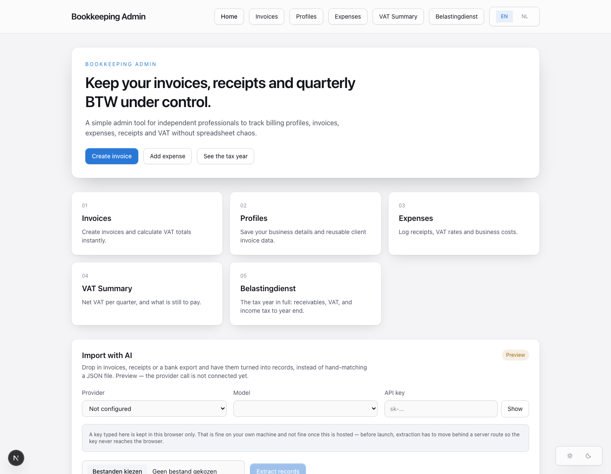
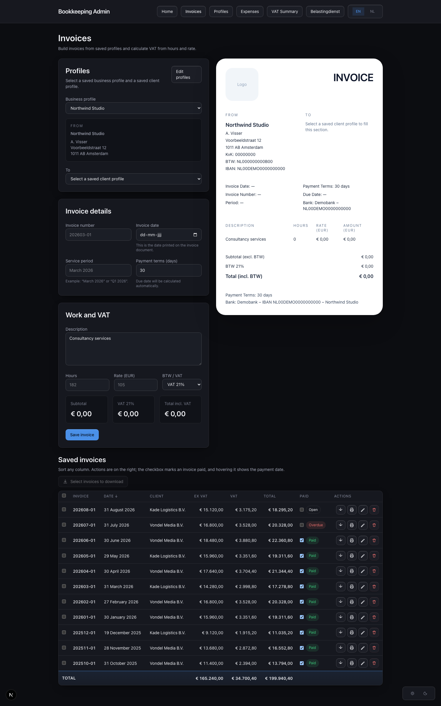
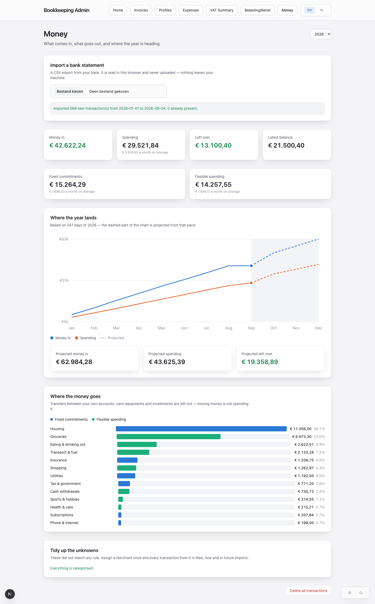
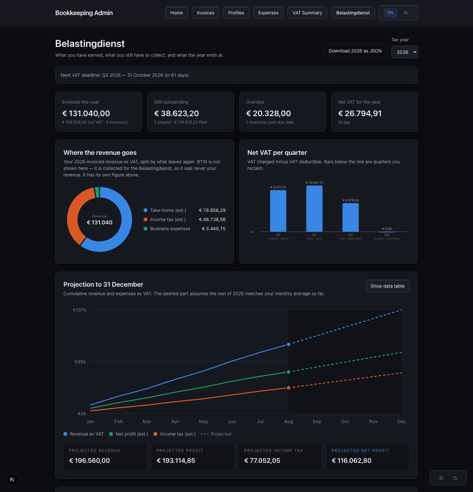

# Bookkeeping Admin

Bookkeeping Admin is a local-first bookkeeping tool for independent professionals and small service businesses in the Netherlands. It covers billing profiles, invoices, expenses, receipts, and quarterly `BTW`/VAT summaries without requiring a subscription product or a hosted backend.

## Why I Built It

I started this project after beginning independent consulting work in the Netherlands and realizing that my bookkeeping workflow felt more complicated than it should. Existing tools were often capable products, but they did not match the experience I wanted: some felt too advanced, some too limited, some visually uninspiring, and many required an ongoing subscription.

I wanted something simpler, more focused, and more aligned with my own way of working. I also wanted to use the project to demonstrate a practical AI-assisted delivery workflow: as a PM, I used OpenAI and Codex to shape requirements, iterate on UX details, and ship a working product that I can continue improving.

## Product Positioning

This is intentionally not a full accounting platform.

The current version is designed around a narrower idea:

- local-first bookkeeping
- privacy-conscious by default
- no required account creation
- no hosted user database
- focused workflows for solo operators and small service businesses

That tradeoff keeps the product lightweight, inexpensive to run, and well scoped as a portfolio project.

## Features

- `Home`: quick access to the main flows, plus backup and AI-assisted import
- `Invoices`: build invoices from saved profiles, calculate VAT from hours and rate, export a one-page PDF, and manage everything in a sortable table with paid/overdue status
- `Profiles`: reusable sender and client billing details, including a letterhead
- `Expenses`: log costs, VAT rates and receipts, filtered by year
- `VAT Summary`: net BTW per quarter, with each quarter markable as filed and paid so the headline shows what is *still* owed
- `Money`: import a bank CSV, see where spending actually goes, and where the year lands — parsed in the browser, never uploaded
- `Belastingdienst`: the whole tax year — receivables, VAT, an income tax estimate with every step shown, and a projection to 31 December
- `Language`: full NL/EN switch; English shows Dutch tax terms alongside, since those are the words on the actual forms
- `Theme`: light and dark, following your system by default with a manual override
- `Local persistence`: everything stored in browser `localStorage`
- `Backup & restore`: export all data to JSON, and merge or replace it back

## Data Safety

All data lives in this browser's `localStorage` and nowhere else. That keeps the app
private and backend-free, but it also means clearing site data, switching browsers or
using a different browser profile will lose everything.

- Export a backup from the dashboard regularly; it downloads a single JSON file.
- Restoring offers **Merge**, which only adds entries that are not already present and
  never overwrites or removes what is already there, and **Replace**, which downloads a
  safety backup of the current data before overwriting it.
- A restore is applied under a rollback guard: if any write fails, every key is put back
  as it was, so a failed restore cannot leave the books half-updated.
- Receipts are stored inline as base64, and the whole origin is limited to roughly 5MB,
  so single receipt files are capped at 1MB.

An optional `public/seed/backfill.json` (gitignored) is applied once on first load, so a
prepared set of books can be loaded without hand entry. It holds real bookkeeping data
and must never be committed.

Bank statements are parsed in the browser and stored locally like everything else;
nothing is uploaded. The free-text notification field is dropped on import because it
carries partial card numbers. `*.csv` is gitignored so an export cannot be committed
by accident.

The AI import panel currently keeps its API key in `localStorage`. That is acceptable on
a personal machine and **not** acceptable hosted — moving extraction behind a server
route is a prerequisite for launch.

BTW figures do not model reverse-charge (`BTW verlegd`), the small business scheme
(`KOR`) or intra-EU supplies, and the income tax estimate ships with editable default
rates that should be checked against belastingdienst.nl. Neither is tax advice.

## Screenshots

All figures below are fictional demo data, not real bookkeeping.

### Home

Quick access to the main flows, with backup and AI-assisted import below.



### Invoices

Saved invoices as a sortable table: select rows to download their PDFs in bulk,
mark paid inline, and read the column totals in the closing row.



### Money

Import a bank statement and the year is laid out: what came in, what went out,
what is committed versus flexible, and where 31 December lands. What the rules
cannot place is grouped by merchant, so one decision files every transaction from
it.



### Belastingdienst

The tax year in one view — receivables, net VAT per quarter, and a projection to
31 December with the income tax estimate broken down step by step. Shown in dark
mode; the app follows your system setting and can be overridden.



## Project Structure

```text
.
├── app/
│   ├── belastingdienst/page.tsx  Tax year overview, charts, income tax estimate
│   ├── btw-summary/page.tsx      Quarterly VAT, with settled-quarter tracking
│   ├── clients/page.tsx          Billing profile management
│   ├── expenses/page.tsx         Expense and receipt tracking
│   ├── finance/page.tsx          Bank import, spending breakdown, year projection
│   ├── invoices/page.tsx         Invoice builder, preview and PDF export
│   ├── components/
│   │   ├── AiImportPanel.tsx     AI-assisted import (preview; provider not wired)
│   │   ├── BackupPanel.tsx       Export / restore bookkeeping data
│   │   ├── InvoiceTable.tsx      Sortable invoice table with row actions
│   │   ├── NavTabs.tsx           Navigation, language and theme controls
│   │   ├── SeedLoader.tsx        One-time local backfill from /seed
│   │   ├── ThemeToggle.tsx       Light / dark / system
│   │   └── charts.tsx            Inline SVG donut, bars and projection
│   ├── layout.tsx                Shared app shell
│   ├── page.tsx                  Home
│   └── globals.css               Design tokens for light and dark
├── lib/
│   ├── ai-import.ts              Extraction contract and provider seam
│   ├── backup.ts                 Backup export, validation and restore
│   ├── bank.ts                   Bank CSV parsing, dedupe and merge
│   ├── billing.ts                Shared billing types and money helpers
│   ├── categories.ts             Spending categories and the rules that assign them
│   ├── finance.ts                Spending aggregation and year projection
│   ├── i18n.ts                   NL/EN dictionary
│   ├── local-storage.ts          Local storage state hook
│   └── tax.ts                    ZZP income tax estimate and BTW deadlines
├── public/                       Static assets
└── README.md
```

## Tech Stack

| Layer | Technology | Purpose |
| --- | --- | --- |
| App framework | `Next.js 16` | App shell, routing, build tooling |
| UI | `React 19` | Client-side UI and stateful forms |
| Language | `TypeScript` | Type safety across app logic |
| Styling | `Tailwind CSS 4` | Layout and visual styling |
| Persistence | `localStorage` | Local-first data storage in the browser |
| Charts | inline SVG | No charting dependency; colours validated for contrast and colourblind separation |
| Tooling | `ESLint` | Basic code quality checks |

## Built With AI

This project is also a practical exploration of AI-assisted product development.

I used AI assistants (initially OpenAI and Codex, more recently Claude Code) to:

- turn rough bookkeeping pain points into product requirements
- define the page split and information architecture
- iterate on invoice, profile, and VAT workflows
- refine form behavior and reusable data models
- review product tradeoffs around privacy, local-first storage, validation, and security
- find and fix real defects: a silent data-loss bug in the storage layer, a VAT summary
  that only counted half a return, and a timezone bug that reported a filing deadline
  a day early

The goal was not just to generate code, but to use AI as part of a real product delivery workflow: moving from a personal problem to a working, testable product.

## Privacy And Scope

This version does not use a backend database. Data is stored locally in the browser/device running the app.

That means:

- no central user data storage
- no authentication layer in the current version
- no multi-device sync
- no responsibility for hosting other users' bookkeeping data

For this stage of the project, that is a deliberate product choice rather than a missing feature.

## Running The Project

Install dependencies and start the development server:

```bash
npm install
npm run dev
```

Open [http://localhost:3000](http://localhost:3000) in your browser.

Available scripts:

```bash
npm run dev
npm run lint
npm run build
npm run start
```

## Deployment

The simplest deployment path is Vercel. The app works well as a public demo because it does not depend on a backend database in its current form.

## Roadmap

### Near term — in this order

**1. Accounts and login.** The next thing to build. Today the app has no notion of a
user: whoever opens the browser sees whatever that browser holds. That is fine for one
person on one machine and blocks everything else — using it on a phone as well as a
laptop, or letting anyone else use it at all.

The approach is end-to-end encryption rather than an ordinary account system: a
passphrase derives a key in the browser, records are encrypted before they are sent,
and the server stores ciphertext it cannot read. That keeps the promise this project
started with — the data belongs to the person who entered it — while making sync
possible. It also means a breach exposes noise rather than anyone's finances.

**2. AI import, after that.** Extraction moves behind a server route so the API key
never sits in the browser, which also closes the standing security gap. That unlocks
categorising the long tail of small local merchants no rule list can cover, and PDF
statements. It is deliberately second: an AI feature on top of an app with no accounts
would be building the roof before the walls.

**3. Then:** MT940/CAMT imports, matching bank transactions against invoices so unpaid
work reconciles itself, and the business/private flag that pushes a deductible cost
straight into the tax picture.

### Where this is heading: personal financial admin, not just bookkeeping

Invoices and BTW are one corner of a freelancer's finances. The same local-first,
privacy-conscious foundation extends naturally to the rest of it, as separate tabs
over a shared ledger:

- **Bank statements** — ✅ CSV import works today, parsed in the browser. Still to do:
  MT940/CAMT, PDF statements, and matching transactions against invoices so unpaid
  work reconciles itself.
- **Expense intelligence** — ✅ categorisation ships with rules covering roughly 93% of
  value on a real statement. Still to do: the business/private flag that would push a
  deductible cost straight into the tax picture, and AI for the long tail of small
  local merchants that no rule list can cover.
- **Mortgage and debt** — hold the mortgage, its rate and remaining term; show interest
  paid per year, which feeds the income tax picture (`eigenwoningforfait`, mortgage
  interest deduction).
- **Net worth** — assets and liabilities in one place, including box 3 holdings, with
  the same year-by-year treatment the tax page already applies to income.
- **Forward view** — extend the existing projection from revenue into full cash flow:
  what is coming in, what is committed, what to keep aside, and what is genuinely free.

Two principles should survive that expansion. Nothing is invented — an estimate is
always shown with the arithmetic behind it, as the income tax breakdown already is.
And anything sensitive stays on the user's machine unless they explicitly choose
otherwise; a hosted version needs a real backend and auth story before it holds
anyone's bank data.

### If it grows beyond local-first

An optional backend for authentication, sync and storage. Deliberately out of scope
for the current version, and a hard prerequisite for the bank-statement work above
ever being offered to anyone but yourself.

## Portfolio Value

This project demonstrates:

- identifying a real user problem from personal experience
- scoping an MVP around a focused use case
- making explicit tradeoffs about privacy, complexity, and cost
- using AI tools to accelerate delivery
- shipping a working interface instead of stopping at a spec or concept

## Status

Bookkeeping Admin is an active portfolio and learning project. The current version is usable as a local-first bookkeeping tool and will continue to evolve through iterative improvements.

Small improvements and documentation updates are committed as the product evolves.
